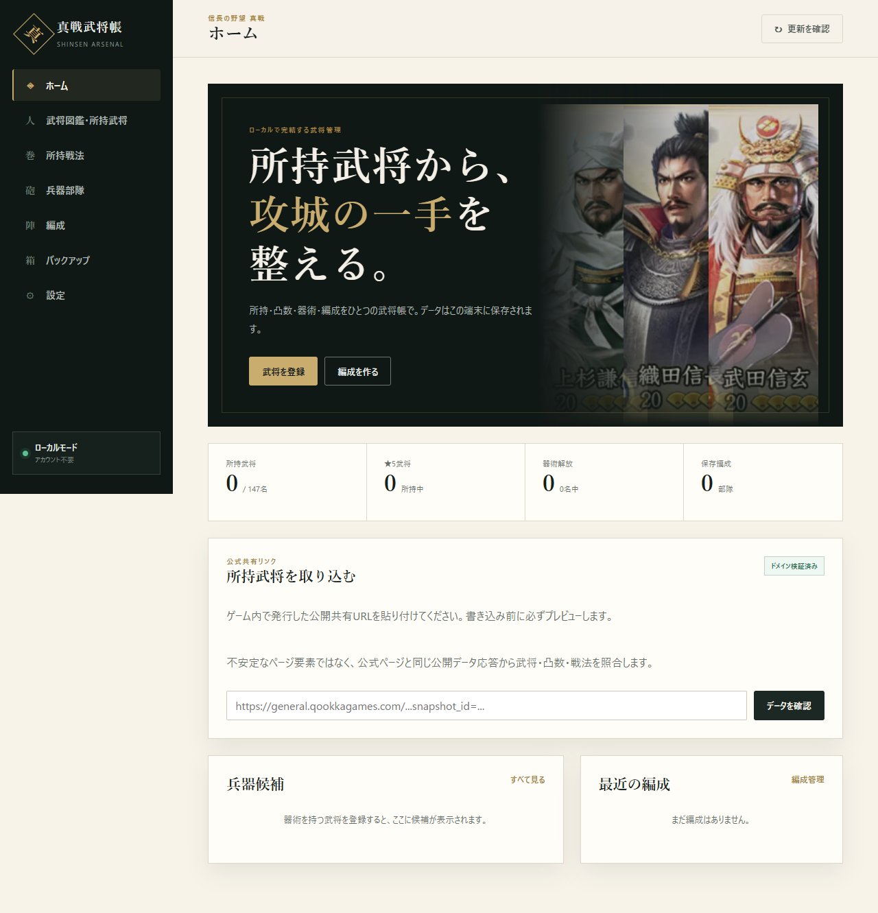
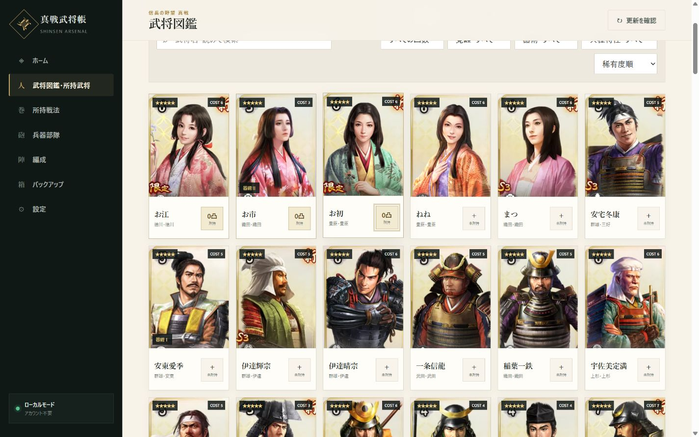
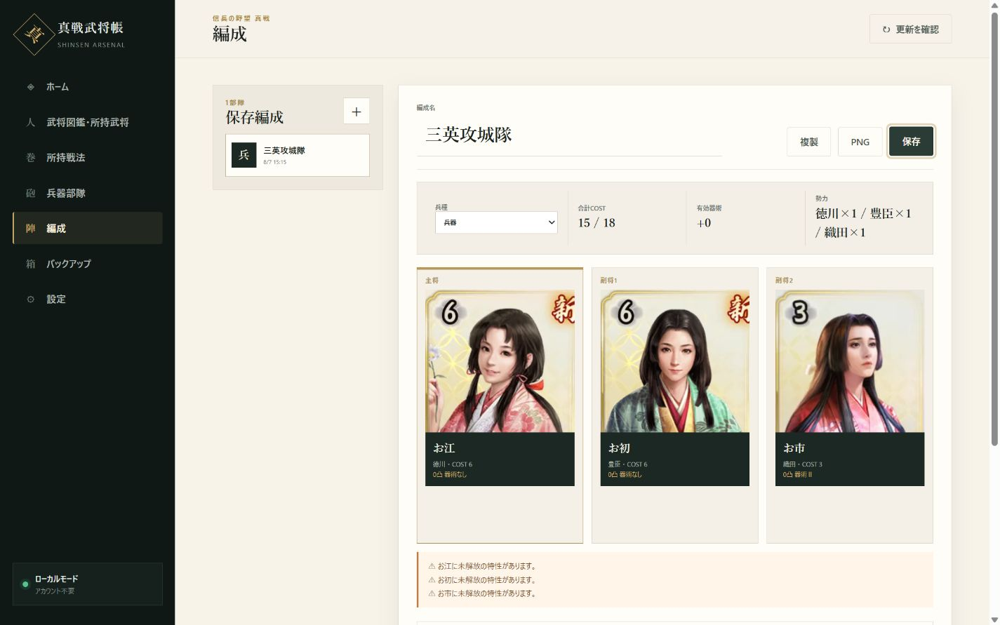
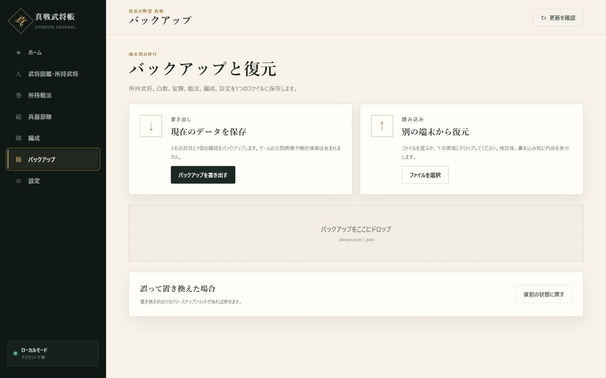

# 真戦武将帳 — Shinsen Arsenal

[](https://github.com/alvesquele967-ops/Shinsen-Arsenal-Local-first-Roster-Formation-Manager/actions/workflows/ci.yml)
[](https://github.com/alvesquele967-ops/Shinsen-Arsenal-Local-first-Roster-Formation-Manager/releases/latest)
[](LICENSE)

『信長の野望 真戦』の所持武将、凸数、覚醒、所持戦法、器術、兵器候補、三人編成を、アカウント登録なしで管理できるローカルファースト Web アプリです。

個人データは原則として利用中のブラウザ内にだけ保存されます。ゲーム内で発行した公開共有 URL がある場合は、公式公開スナップショットから所持情報を一括でプレビューし、確認後に取り込めます。共有 URL を利用できない場合も、武将カードを押すだけで手動登録できます。

> [!IMPORTANT]
> 本ツールは非公式のファンツールです。株式会社コーエーテクモゲームス、Qookka Games、および関連する運営会社との公式な関係、承認、提携はありません。ゲーム名、武将名、画像、ロゴ、商標、ゲーム内データの権利は各権利者に帰属します。

## 目次

- [画面](#画面)
- [主な機能](#主な機能)
- [最短で起動する](#最短で起動する)
- [必要環境](#必要環境)
- [通常の使い方](#通常の使い方)
- [アカウントなしで共有 URL を取り込める仕組み](#アカウントなしで共有-url-を取り込める仕組み)
- [ローカル保存の仕組み](#ローカル保存の仕組み)
- [バックアップと端末移行](#バックアップと端末移行)
- [更新確認の仕組み](#更新確認の仕組み)
- [編成 PNG の仕組み](#編成-png-の仕組み)
- [ポート番号と利用者向け設定](#ポート番号と利用者向け設定)
- [開発環境](#開発環境)
- [公開データの更新](#公開データの更新)
- [テストと品質確認](#テストと品質確認)
- [ビルドと配布](#ビルドと配布)
- [よくあるエラーと原因](#よくあるエラーと原因)
- [プライバシーとセキュリティ](#プライバシーとセキュリティ)
- [ディレクトリ構成](#ディレクトリ構成)
- [参考プロジェクト・データ出典・ライセンス](#参考プロジェクトデータ出典ライセンス)
- [既知の制限](#既知の制限)
- [English quick overview](#english-quick-overview)

## 画面

### ホームと公式共有 URL 取り込み



### 武将図鑑と所持登録



### 三人編成



### バックアップと復元



## 主な機能

- 日本語版の武将 147 名、戦法 213 個を収録
- 武将画像、稀有度、勢力、家門、COST、能力値、固有戦法、伝授戦法、特性、器術を表示
- 漢字、ひらがな、カタカナ、全角・半角の違いを吸収した武将検索
- 所持・未所持、稀有度、勢力、COST、凸数、覚醒、器術、兵種関連特性による絞り込み
- カードから `未所持 → 0凸 → 1凸 → … → 満凸 → 未所持` を素早く切り替え
- 詳細画面で覚醒、タグ、備考、装着戦法を編集
- 公式公開共有 URL から武将、凸数、所持戦法をプレビューして統合
- 公式 URL を使えない場合の完全な手動登録
- 器術のレベルと解放凸数を考慮した兵器部隊候補の確定的な順位付け
- 主将 1 名、副将 2 名、兵種、戦法、メモを含む複数編成の保存・複製・削除
- COST 超過、重複武将、未所持武将、未解放特性、勢力構成のリアルタイム表示
- 武将画像入り 1200 × 630 px 編成 PNG の書き出し
- Schema Version 付きバックアップの書き出し、内容プレビュー、置き換え、統合
- v1 → v2 → v3 の段階的なバックアップ移行
- 置き換え直前の自動リカバリースナップショット
- 公開武将データと PWA の更新確認
- インストール可能な PWA と、読み込み済みアプリシェルのオフライン利用
- Windows 用の一括起動ファイル。依存準備、サーバー起動、ブラウザ表示を自動化

## 最短で起動する

### Windows：一括起動

1. [Node.js](https://nodejs.org/) 20 以上をインストールします。
2. このリポジトリをダウンロードまたは clone します。
3. ルートにある `start.cmd` をダブルクリックします。
4. 初回のみ `npm install` が自動実行されます。
5. サーバーの準備が完了すると、`http://127.0.0.1:4173` が既定ブラウザで自動的に開きます。4173 が使用中なら、4174 以降の空きポートを自動選択します。
6. 終了するときは、起動したコマンド画面で `Ctrl+C` を押します。

通常は空きポートを自動選択するため、ダブルクリックだけで構いません。使用する番号を固定したい場合は、コマンドプロンプトまたは PowerShell で次のように指定します。

```bat
start.cmd 4174
```

PowerShell スクリプトを直接使う場合は次のとおりです。

```powershell
.\script\start_shinsen.ps1 -Port 4174
```

起動スクリプトは PowerShell の実行ポリシーを恒久的には変更しません。現在の 1 回の起動だけ `-ExecutionPolicy Bypass` を指定します。

### Windows / macOS / Linux：npm から起動

```bash
npm install
npm run dev -- --host 127.0.0.1 --port 4173
```

表示された URL をブラウザで開きます。開発サーバーを終了するときは `Ctrl+C` を押します。

### 再現性を重視する場合

`package-lock.json` と完全に同じ依存バージョンを入れる場合は `npm install` ではなく `npm ci` を使用します。

```bash
npm ci
npm run dev -- --host 127.0.0.1 --port 4173
```

## 必要環境

| 用途 | 必要なもの | 備考 |
|---|---|---|
| アプリの通常利用 | Node.js 20 以上、npm 10 以上、モダンブラウザ | Python、アカウント、API キーは不要 |
| 公開データ再生成 | Python 3.10 以上 | `requirements.txt` の導入が必要 |
| TypeScript 単体テスト | Node.js / npm | Vitest を使用 |
| Python データテスト | Python 3.10 以上 | pytest を使用 |
| E2E テスト | Chromium | Playwright が管理する Chromium を推奨 |
| PWA | Service Worker 対応ブラウザ | localhost または HTTPS が必要 |

動作対象は現在の Chrome、Edge、Firefox、Safari を想定しています。IndexedDB、Service Worker、Canvas、`crypto.randomUUID()` を利用するため、古いブラウザは対象外です。

通常利用では次のものは不要です。

- ユーザーアカウント
- ゲームのログイン ID やパスワード
- Supabase
- OAuth
- OpenAI API キー
- Qookka Games の秘密鍵
- サーバー側データベース
- Python

## 通常の使い方

### 1. 武将を手動で登録する

1. 左メニューの「武将図鑑・所持武将」を開きます。
2. 武将名、読み、勢力、COST、器術などで目的の武将を絞り込みます。
3. カード右下の「＋ 未所持」を押すと 0 凸で登録されます。
4. 同じボタンを押すたびに凸数が 1 つ上がります。
5. カード画像を押すと詳細画面が開き、覚醒、タグ、備考、装着戦法を編集できます。

カードの循環は高速登録向けです。満凸からもう一度押すと未所持へ戻るため、誤操作が心配な場合は詳細画面で内容を確認してください。

### 2. 共有 URL から一括登録する

1. ゲームまたは公式共有ページで、所持手帳・武将手帳の公開共有機能を開きます。
2. 発行された URL をコピーします。メニュー名はゲームのバージョンや地域によって異なる場合があります。
3. 真戦武将帳のホームにある「所持武将を取り込む」へ URL を貼り付けます。
4. 「データを確認」を押します。
5. 武将数、戦法数、未一致数のプレビューを確認します。
6. 問題がなければ「現在のデータと統合」を押します。

対応する URL の基本形は次のとおりです。

```text
https://general.qookkagames.com/xzdyw-station-qookka#/handbook?snapshot_id=...
```

画面上の文字や DOM をコピーした URL、ログイン後だけ開ける個人ページ、短縮 URL、別ドメインの URL には対応していません。

### 3. 編成を作る

1. 先に 3 名以上の武将を所持登録します。
2. 「編成」を開きます。
3. 主将、副将 1、副将 2 を選択します。
4. 兵種、戦法、編成名、メモを設定します。
5. COST、器術、勢力、警告、能力値合計を確認します。
6. 「保存」を押します。
7. 「PNG」を押すと、武将画像入りの編成画像を書き出します。

### 4. 所持戦法を登録する

「所持戦法」を開き、戦法名・読み・種類で検索して所持状態を切り替えます。登録した戦法は武将詳細と編成画面の戦法候補に利用されます。

### 5. 兵器候補を見る

器術を持つ武将を登録すると、ホームと「兵器部隊」に候補が表示されます。器術レベル、必要凸数、現在の解放状態、能力値を使って同じ入力なら常に同じ順序になるよう順位付けします。

## アカウントなしで共有 URL を取り込める仕組み

### 結論

ゲームのアカウントへログインしているのではありません。ユーザー自身が発行した「公開共有スナップショット」を、共有 URL に含まれる一時的な公開 ID で読み取っています。

### 処理の流れ

1. 共有 URL の `snapshot_id` をブラウザ側で抽出します。
2. `https`、許可ドメイン、パス、ID の文字種と長さを検証します。
3. ブラウザは同一オリジンの `/api/qookka-snapshot` へ `snapshot_id` だけを送ります。
4. ローカル開発サーバーまたは Sites Worker が、公式共有ページ自身も利用する読み取り専用の公開スナップショット応答へ問い合わせます。
5. 公式公開設定データを使い、数値の武将 ID・戦法 ID を日本語名へ補完します。
6. フロントエンドで、取り込んだ名前・公式 ID と収録カタログを照合します。
7. 武将、凸数、所持戦法、未一致項目をプレビューします。
8. ユーザーが統合を押した後にだけ IndexedDB へ書き込みます。

### なぜログインが不要なのか

公開共有 URL は、他人が閲覧できることを前提としてゲーム側が発行する URL です。URL の所有者が共有した範囲のスナップショットは、ゲームのログイン Cookie やパスワードを送らなくても公開 ID で取得できます。本アプリはその公開範囲だけを読み取り、ゲームアカウントへのログイン操作、認証回避、非公開 API への侵入を行いません。

### なぜ XPath やバックグラウンドブラウザを使わないのか

公式共有ページは Taro などで構築され、`//*[@id="undefined"]/...` のような絶対 XPath はビルド、端末幅、表示順、遅延読み込みで変化します。DOM を背景ブラウザで開いて要素位置を読む方式は、次の理由で不安定です。

- CSS クラスや DOM 階層が更新で変わる
- 仮想リストにより画面外の武将が DOM に存在しないことがある
- スクロール位置、端末幅、読み込み時間に依存する
- 画像・テキストから凸数を復元すると誤認識しやすい
- ブラウザ自動操作の保守とセキュリティ負担が大きい

そのため本プロジェクトは、共有ページが表示に使う構造化された公開応答を読み、DOM や絶対 XPath には依存しません。

### 同一オリジン API が必要な理由

ブラウザには CORS 制約があり、フロントエンド JavaScript から別ドメインの公開応答を直接読めない場合があります。そこで次の 2 箇所で同じ API を提供します。

- `npm run dev`：Vite のローカル middleware
- Sites 配布版：`src/server/worker.ts` の Worker

任意 URL をサーバーが取得できる設計にはしていません。受け付けるのは検証済み `snapshot_id` だけで、接続先はコード内で固定しています。

### 共有 URL を保存しない理由

`snapshot_id` を含む URL は、バックアップ、IndexedDB、サーバーログ用データベースへ保存しません。取得時にメモリ上で利用し、永続化するのはユーザーが確認した所持武将、凸数、所持戦法と、照合できなかった項目だけです。

## ローカル保存の仕組み

### Local Mode

Local Mode は「アカウントがないと使えない機能を減らしたモード」ではなく、本アプリの標準動作です。所持武将、凸数、覚醒、タグ、備考、所持戦法、編成、表示設定、取り込み履歴は [Dexie](https://dexie.org/) を通してブラウザの IndexedDB に保存されます。

```text
画面操作
  ↓
Vue の状態
  ↓
入力検証・正規化
  ↓
Dexie transaction
  ↓
ブラウザ IndexedDB
```

サーバー側のユーザーテーブルはありません。ページを再読み込みしたときは IndexedDB から状態を読み直します。

### 公開データと個人データの分離

| 種類 | 保存場所 | Git に含まれるか | バックアップに含まれるか |
|---|---|---:|---:|
| 武将名、画像 URL、能力、器術などの公開カタログ | `src/shinsen/data/` | はい | いいえ |
| データベースバージョン | `src/shinsen/data/meta.json` / `public/data-version.json` | はい | バージョン文字列のみ |
| 所持武将、凸数、覚醒、備考 | IndexedDB | いいえ | はい |
| 所持戦法 | IndexedDB | いいえ | はい |
| 保存編成 | IndexedDB | いいえ | はい |
| UI 設定 | IndexedDB | いいえ | はい |
| 共有 URL と `snapshot_id` | 永続保存しない | いいえ | いいえ |
| 武将画像本体 | 外部画像 / ブラウザキャッシュ | いいえ | いいえ |

### データがブラウザごとに分かれる理由

IndexedDB は「オリジン」単位で分離されます。次の URL は同じ PC でも別の保存領域です。

- `http://127.0.0.1:4173`
- `http://localhost:4173`
- `http://127.0.0.1:4174`
- 配布サイトの HTTPS URL

ポート番号、ホスト名、プロトコルのどれかが変わると別データとして扱われます。起動ポートを変更する前、別 URL へ移る前、ブラウザを変更する前にはバックアップを書き出してください。

### データが消える可能性がある操作

- ブラウザ設定からサイトデータを削除する
- シークレット / プライベートウィンドウを閉じる
- OS やブラウザのクリーンアップ機能で IndexedDB を削除する
- 「設定」の「ローカルデータを初期化」を実行する
- 別ポート、別ホスト名、別ブラウザで開く
- ブラウザプロファイルを削除する

重要なデータは定期的に `.shinsen.json` へ書き出してください。

## バックアップと端末移行

### 書き出し

1. 「バックアップ」を開きます。
2. 件数表示を確認します。
3. 「バックアップを書き出す」を押します。
4. `shinsen-backup-日時.shinsen.json` を安全な場所へ保存します。

バックアップには次を含みます。

- 所持武将と凸数
- 覚醒状態
- 武将タグと備考
- 装着戦法 ID
- 所持戦法と備考
- 保存編成
- 表示設定と COST 上限
- 公式取り込み・バックアップ取り込みの日時メタデータ
- カタログと一致しなかった取り込み項目

次は含みません。

- 武将画像ファイル
- 公開武将カタログ全体
- Cookie
- セッション
- ゲームのログイン情報
- API キー
- 共有 URL と `snapshot_id`

### 別端末で復元する

1. 移行先で同じアプリを開きます。
2. 「バックアップ」を開きます。
3. 「ファイルを選択」を押すか、点線領域へファイルをドロップします。
4. Schema Version、所持武将数、所持戦法数、編成数、未一致数を確認します。
5. 「現在のデータを置き換える」または「現在のデータと統合する」を選びます。
6. 武将図鑑、編成、設定を開いて内容を確認します。

### 置き換えと統合の違い

| モード | 動作 | 向いている状況 |
|---|---|---|
| 置き換え | 現在の個人データをバックアップ内容で置き換える | 新しい端末へ完全移行する |
| 統合 | 現在データを残しながらバックアップ内容をマージする | 2 端末の登録をまとめる |

統合ルールは次のとおりです。

- 同じ武将の凸数：高い方
- 覚醒：どちらかが覚醒済みなら覚醒済み
- 備考：現在側を優先し、空の場合に読み込み側を利用
- タグ：重複を除いて結合
- 装着戦法：重複を除いて結合
- 同じ ID で内容が異なる編成：読み込み側を「（読込）」付きで複製
- UI 設定：現在側を維持

### 安全性

- JSON を書き込む前に型、必須項目、Schema Version を検証します。
- ファイルサイズ上限は 5 MB です。
- 「置き換え」の直前に現在データを Recovery Snapshot として自動保存します。
- 置き換えは 1 回の IndexedDB transaction で処理します。
- 読み込みに失敗した場合は現在データを変更しません。
- 「直前の状態に戻す」で最新 Recovery Snapshot を復元できます。

### Schema Migration

現在のバックアップ形式は Schema v3 です。古いバックアップは `v1 → v2 → v3` の順で 1 段階ずつ変換します。形式を将来変更するときは Schema Version を上げ、`src/shinsen/migrations/` に隣接バージョン間の移行を追加してください。

## 更新確認の仕組み

画面右上または設定画面の「更新を確認」は、次の 2 種類を確認します。

1. Service Worker に新しい PWA アプリがあるか
2. 配布先の `/data-version.json` と、現在読み込まれている `meta.json` の `databaseVersion` が一致するか

処理は次のとおりです。

```text
更新を確認
  ├─ navigator.serviceWorker.getRegistration().update()
  └─ /data-version.json?現在時刻 を cache: no-store で取得
       ↓
  現在の databaseVersion と比較
       ↓
  最新 / 更新あり / オフライン を表示
```

「更新あり」の場合は確認後に再読み込みします。公開カタログが更新されても、IndexedDB の個人データは武将の安定 ID で保持されます。データ更新前にもバックアップを推奨します。

ローカルのソースコードを更新する機能ではありません。GitHub から clone した開発者は `git pull`、依存更新、再ビルドを別途行ってください。

## 編成 PNG の仕組み

「PNG」は現在の編成を 1200 × 630 px の Canvas に描画します。

描画内容は次のとおりです。

- 編成名
- 兵種
- 合計 COST
- 主将と副将 2 名の武将画像
- 武将名
- 勢力
- 凸数
- 器術
- 編成全体の有効器術と勢力内訳

### なぜ画像用 API が必要なのか

通常の `` は外部サイトの画像を画面表示できますが、その画像を Canvas に描いて PNG 化するときは CORS 制約を受けます。外部サーバーが適切な CORS header を返さない場合、画像読み込みに失敗するか Canvas が汚染され、`toBlob()` で書き出せません。

本アプリは `/api/portrait` から画像を同一オリジンとして取得します。セキュリティのため次を固定しています。

- HTTPS のみ
- ホストは `img.game8.jp` と完全一致する場合のみ
- redirect は拒否
- MIME type が `image/*` の場合のみ
- 1 枚 5 MB 以下
- 12 秒で timeout
- `nosniff` を付与

書き出し後の通知に `武将画像 3名` と出れば、3 枚とも Canvas へ読み込めています。`1/3名` などと表示された場合は、ネットワーク、外部画像配信、または `/api/portrait` の配布設定を確認してください。

## ポート番号と利用者向け設定

### 一時的にポートを変更する

```bat
start.cmd 4300
```

```powershell
.\script\start_shinsen.ps1 -Port 4300
```

```bash
npm run dev -- --host 127.0.0.1 --port 4300
```

有効範囲は 1024～65535 です。

### 一括起動の既定ポートを恒久的に変更する

`script/start_shinsen.ps1` 冒頭の次の値を変更します。

```powershell
[int]$Port = 4173
```

たとえば 4300 を既定にする場合は次のようにします。

```powershell
[int]$Port = 4300
```

ポートを変えると IndexedDB の保存領域も変わるため、既存データを移す場合は変更前にバックアップを書き出し、新しい URL で読み込んでください。

### アプリ内で変更できる項目

「設定」から次を変更できます。

- ★3 武将を初期表示で隠すか
- 編成 COST 上限（3～30）

### 開発者が変更する代表的な場所

| 変更内容 | ファイル |
|---|---|
| アプリ名、PWA 名、テーマ色、キャッシュ | `vite.config.ts` |
| 画面色、文字、レスポンシブ幅 | `src/shinsen/styles.css` |
| ルートとメニュー先 | `src/shinsen/router.ts` / `src/shinsen/AppShell.vue` |
| 武将・戦法公開データ | `src/shinsen/data/` |
| バックアップ形式 | `src/shinsen/types.ts` / `src/shinsen/domain/backup.ts` / `src/shinsen/migrations/` |
| Qookka 接続先・検証 | `src/server/qookkaProxy.ts` |
| 編成 PNG 用画像検証 | `src/server/portraitProxy.ts` |
| Sites Worker | `src/server/worker.ts` |
| Windows 既定ポート | `script/start_shinsen.ps1` |

## 開発環境

### 依存パッケージを準備する

```bash
npm install
python -m pip install -r requirements.txt
```

通常の画面開発だけなら Python 依存は不要です。Python は公開データの再取得、生成、検査、Python テストを実行するときに使います。

### 開発サーバー

```bash
npm run dev
```

Vite の既定 URL を利用します。利用する URL を固定したい場合は明示します。

```bash
npm run dev -- --host 127.0.0.1 --port 4173
```

開発サーバーでは `vite.config.ts` が次の同一オリジン API を提供します。

- `/api/qookka-snapshot`：公式公開共有スナップショットの読み取り
- `/api/portrait`：編成 PNG 用の許可済み武将画像取得

### 主な npm script

| コマンド | 内容 |
|---|---|
| `npm run dev` | Vite 開発サーバー |
| `npm run typecheck` | `vue-tsc --noEmit` による型検査 |
| `npm test` | Vitest 単体テスト |
| `npm run test:watch` | Vitest watch mode |
| `npm run test:python` | Python データテスト |
| `npm run test:e2e` | Playwright E2E |
| `npm run data` | 取得済み raw データから公開 JSON を再生成 |
| `npm run data:check` | 公開カタログの完全性検査 |
| `npm run crawl` | Game8 公開ページから詳細データを低頻度で取得 |
| `npm run build` | データ・型検査後に Web と Sites Worker をビルド |
| `npm run preview` | `dist/` の静的部分をローカル preview |

### 技術構成

- [Vue 3](https://vuejs.org/)：UI と Composition API
- [TypeScript](https://www.typescriptlang.org/)：型安全なドメイン・UI
- [Vite](https://vite.dev/)：開発サーバーと本番ビルド
- [Vue Router](https://router.vuejs.org/)：履歴ベースの画面遷移
- [Dexie](https://dexie.org/)：IndexedDB の transaction とテーブル管理
- [Vite PWA Plugin](https://vite-pwa-org.netlify.app/)：Manifest と Service Worker
- [Vitest](https://vitest.dev/)：TypeScript 単体テスト
- [pytest](https://pytest.org/)：データ生成・検査テスト
- [Playwright](https://playwright.dev/)：ブラウザ E2E
- [esbuild](https://esbuild.github.io/)：Sites Worker の bundle

大きな Store へ全機能を集めず、次の層に分離しています。

```text
views / components
       ↓
state.ts（画面状態と永続化の調停）
       ↓
domain / importers / migrations（純粋関数を優先）
       ↓
db.ts（Dexie / IndexedDB）

server
  ├─ qookkaProxy.ts
  ├─ portraitProxy.ts
  └─ worker.ts
```

検索、器術判定、兵器候補順位、編成集計、バックアップ統合、Schema Migration、公式応答正規化は UI から分離し、単体テスト可能にしています。

## 公開データの更新

### データの流れ

```text
Game8 公開日本語ページ
  ↓  crawl_heroes.py
raw YAML / cache
  ↓  build_shinsen_data.py
正規化・安定 ID・読み・器術解放条件・version hash
  ↓
src/shinsen/data/heroes.json
src/shinsen/data/skills.json
src/shinsen/data/meta.json
public/data-version.json
  ↓  check_shinsen_data.py
重複・欠損・参照・画像・件数・器術の検査
```

### 更新手順

```bash
python -m pip install -r requirements.txt
python script/crawl_heroes.py --detail
python script/build_shinsen_data.py
python script/check_shinsen_data.py
```

npm script を使う場合は次のとおりです。

```bash
npm run crawl
npm run data
npm run data:check
```

### crawler の代表的なオプション

```bash
# 一覧だけを確認
python script/crawl_heroes.py

# 詳細を含む全件
python script/crawl_heroes.py --detail

# 30名だけを検証
python script/crawl_heroes.py --detail --limit 30

# 名前を含む武将だけ
python script/crawl_heroes.py --detail --name 信長

# 一覧 cache を更新し、詳細 cache は利用
python script/crawl_heroes.py --refresh-index --detail

# cache を使わず再取得
python script/crawl_heroes.py --force --detail

# timeout 秒数を変更
python script/crawl_heroes.py --detail --timeout 30
```

外部サイトへ負荷をかけないよう、通常は cache を利用し、詳細取得の間隔を設けています。CI や通常の `npm run build` は外部サイトを crawl しません。検証済み JSON はリポジトリに含め、ビルドの再現性を保ちます。

### 安定 ID

可能な武将は `davidjaw/Shinsei-Lineup` 由来の公開 cfg snapshot に含まれる数値 ID を使い、Qookka 公式共有応答と照合しやすくしています。対応 ID がない場合は Game8 の詳細ページ ID、さらに必要なら正規化名の hash を使います。戦法 ID は正規化した日本語名の SHA-1 短縮 hash から作ります。

公開カタログを更新するときは、既存 ID を不用意に変えないでください。ID が変わると IndexedDB に保存済みの個人データと新カタログの関連が切れます。

### 読みの生成

`pykakasi` で読みを生成し、固有名詞で誤りやすい武将は `KANA_CORRECTIONS` で補正します。検索側では NFKC 正規化、空白除去、カタカナからひらがなへの正規化を行います。

### データ検査

`script/check_shinsen_data.py` は少なくとも次を検査します。

- 武将 ID と名前の重複
- 必須フィールド欠損
- 稀有度が 3・4・5 の範囲か
- 能力値が正の整数か
- 画像 URL と出典 URL があるか
- 器術レベルが I～III か
- 器術解放凸数が 0～5 か
- 固有戦法参照先が存在するか
- 最低武将件数と ★5 件数
- カタログ version と公開 version の一致（Python test）

現在の収録情報は `src/shinsen/data/meta.json` を参照してください。現行版は 147 武将、213 戦法です。

## テストと品質確認

### 推奨する完全検証

```bash
npm ci
python -m pip install -r requirements.txt
npm run data:check
npm run typecheck
npm test
npm run test:python
npm run build
npx playwright install chromium
npm run test:e2e
```

### テスト範囲

| 種類 | 主な検証内容 |
|---|---|
| Vitest | 検索正規化、器術解放、候補順位、編成集計、バックアップ、Migration、Merge |
| Vitest | Qookka URL 検証、公式応答正規化、失効 URL、許可外 ID |
| Vitest | PNG 画像 proxy の host・HTTPS・MIME・size 制約 |
| pytest | 安定 hash、読み補正、カタログ件数、version 一致、器術整合 |
| Playwright | 日本語ホーム、更新確認、共有 URL 取り込み、手動所持登録、再読み込み永続化 |
| Playwright | 器術 filter、三人編成、武将画像入り PNG、バックアップ書き出し、全削除、復元 |
| Playwright | 390 px 幅のモバイルナビゲーション |

### GitHub Actions

`.github/workflows/ci.yml` は push と pull request で次を実行します。

- Node.js 20
- Python 3.10
- `npm ci`
- Python requirements
- 公開データ検査
- TypeScript 型検査
- Vitest
- pytest
- 本番 build
- Chromium E2E

### 人工確認項目

リリース前には自動テストに加え、次も確認してください。

- ホームが白画面にならない
- Console に重大な Runtime Error がない
- UI が自然な日本語になっている
- 武将画像が表示される
- 所持登録、凸数、覚醒が再読み込み後も残る
- 器術と解放条件が正しい
- 兵器候補順位が入力に対して安定している
- 三人編成を保存・再表示できる
- PNG に 3 名の武将画像が入る
- バックアップを新規ブラウザ環境へ復元できる
- モバイル幅で下部ナビと主要操作が使える

## ビルドと配布

### 本番ビルド

```bash
npm run build
```

処理順は次のとおりです。

1. `npm run data:check`
2. `npm run typecheck`
3. `vite build`
4. `script/build_worker.mjs`

成果物は `dist/` に生成されます。

```text
dist/
  index.html
  assets/
  manifest.webmanifest
  sw.js
  data-version.json
  server/index.js
```

`dist/server/index.js` は Sites 用 Worker です。SPA の history fallback、Qookka snapshot API、portrait API を担当します。

### preview の注意

```bash
npm run preview -- --host 127.0.0.1 --port 4173
```

Vite preview は静的成果物の確認用で、Sites Worker を実行しません。画面、IndexedDB、検索、手動登録、編成、バックアップは確認できますが、次は配布環境の server route がないと動きません。

- 公式共有 URL の自動取り込み
- 編成 PNG の外部武将画像 proxy

すべての機能をローカル確認するときは `npm run dev` または `start.cmd` を使ってください。

### 静的ホスティング

GitHub Pages などへ `dist/` の静的ファイルだけを置くと、基本画面は動きますが `/api/qookka-snapshot` と `/api/portrait` は提供されません。完全機能で公開するには、同等の serverless route または Worker を用意してください。

serverless route を移植する場合も、任意 URL proxy に変えないでください。現在の host allowlist、protocol、ID pattern、response size、MIME type、timeout、redirect 制約を維持してください。

### OpenAI Sites

このリポジトリには `.openai/hosting.json` があり、現在の Sites project ID を保持しています。これは API key や秘密情報ではありませんが、fork した利用者は自分の Sites project と紐付け直すか、Sites を使わない場合は削除してください。

Sites では `dist/` と `dist/server/index.js` を同時に配布するため、共有 URL 取り込みと編成 PNG を含む全機能を提供できます。

## よくあるエラーと原因

### 起動・依存・ポート

| 表示・症状 | 主な原因 | 対処 |
|---|---|---|
| `Node.js が見つかりません` | Node.js が未導入、または PATH にない | Node.js 20 以上を導入し、端末を開き直して `node --version` を確認 |
| `npm` / `npm.cmd` が見つからない | npm を含まない Node 配布、PATH 未反映 | 公式 Node.js LTS を再導入し `npm --version` を確認 |
| `Port 4173 is already in use` | 別アプリ、別 Vite、前回のサーバーが 4173 を使用中 | `start.cmd` は通常自動回避。npm 直起動なら別ポートを指定 |
| `EADDRINUSE` | 指定ポートが使用中 | 別ポートへ変更。既存プロセスを終了する場合は自分が起動したものか確認 |
| 一瞬で画面が閉じる | 起動スクリプト内でエラー | コマンドプロンプトから `start.cmd` を実行してメッセージを読む |
| ブラウザが自動で開かない | 既定ブラウザ設定、セキュリティソフト、起動待機 timeout | 端末に表示された `http://127.0.0.1:ポート` を手動で開く |
| `npm install` が失敗 | proxy、社内 network、証明書、npm registry、ディスク不足 | network と npm 設定を確認。`npm cache verify` 後に再試行 |
| `npm ci` が package mismatch で失敗 | `package.json` と `package-lock.json` の不一致 | 開発者は `npm install` で lock を更新し、両方 commit。利用者は最新版を取得 |
| PowerShell script を実行できない | 実行ポリシーまたは endpoint protection | `start.cmd` を使用。手動なら README の `-ExecutionPolicy Bypass` 付き launcher を確認 |
| Python package がない | データ更新用 requirements 未導入 | `python -m pip install -r requirements.txt` |

使用中ポートを読み取り専用で確認する例です。

```powershell
Get-NetTCPConnection -LocalPort 4173 -State Listen
```

```bat
netstat -ano | findstr :4173
```

プロセスを強制終了する前に、その PID が自分の起動した開発サーバーか必ず確認してください。別アプリの可能性がある場合は、終了せず別ポートを使うのが安全です。

### 白画面・古い画面・PWA

| 表示・症状 | 主な原因 | 対処 |
|---|---|---|
| 白画面 | 古い JS cache、壊れた build、Runtime Error | DevTools Console を確認し、強制再読み込み。`npm run build` も確認 |
| 更新したのに画面が変わらない | Service Worker が旧 asset を保持 | 「更新を確認」、強制再読み込み、必要なら対象サイトの Service Worker を解除 |
| `data-version.json` 404 | 配布時に `public/` が含まれていない | `npm run build` で `dist/data-version.json` を生成し直す |
| 直接 `/heroes` を開くと 404 | server の SPA fallback がない | `index.html` へ fallback する設定を追加。Sites Worker では対応済み |
| PWA を install できない | HTTP の remote URL、Manifest/Service Worker 不備 | localhost または HTTPS で配布し、Console の PWA error を確認 |

Service Worker を削除するとオフライン cache は消えますが、通常 IndexedDB の個人データは別 storage として残ります。ただしブラウザの「サイトデータをすべて削除」は IndexedDB も消すため、先にバックアップしてください。

### 公式共有 URL 取り込み

| 表示・症状 | 原因 | 対処 |
|---|---|---|
| `共有URLの形式が正しくありません` | 許可外 domain、HTTP、path 違い、`snapshot_id` 不在 | 公式共有機能から URL 全体をコピー |
| `snapshot_idの形式が正しくありません` | ID が短い、欠損、記号が不正 | URL を途中で省略せずコピー。`...` を含む表示用 URL は不可 |
| `共有リンクの有効期限が切れているか、すでに無効です` / 410 | 公式 snapshot が失効または無効 | ゲーム側で新しい共有 URL を発行 |
| `公式サイトからデータを取得できませんでした` / 502 | 公式 upstream の一時障害、応答形式変更、network 制限 | 時間を置いて再試行。継続する場合は手動登録と issue 報告 |
| `公式サイトへの接続がタイムアウトしました` / 504 | 15 秒以内に公式応答がない | network を確認し再試行。VPN/proxy を変更する場合は組織ルールに従う |
| `公式サイトの応答形式を確認できませんでした` | 公式 response が想定 JSON でない | 自動取り込みを中止し、手動登録。公式仕様変更の可能性を報告 |
| プレビューが 0 名 | snapshot に対象 view がない、公式仕様変更、共有範囲が空 | URL の共有内容を確認し、新しい URL を発行 |
| 「未一致」が出る | 公式 ID/名称と収録カタログが一致しない新武将・表記差 | 未一致は勝手に別武将へ割り当てず保存。カタログ更新後に再取り込み |
| 古い `現在の公開環境では自動取得を利用できません` が出る | 古い静的 build または Worker のない配布 | 最新 build へ更新。完全機能は `start.cmd` / `npm run dev` / Worker 付き配布で利用 |
| 公式共有ページを開けるのに本アプリで失敗 | ページ表示と構造化 snapshot API の状態が異なる場合がある | 新規共有 URL を発行し再試行。失効なら 410 になる |

取り込みは DOM や XPath を使わないため、共有ページをバックグラウンドで開いたままにする必要はありません。また、ゲームのログイン Cookie を本アプリへ渡さないでください。

### 武将画像・編成 PNG

| 表示・症状 | 原因 | 対処 |
|---|---|---|
| 武将カードが「画像なし」 | 外部画像 URL の停止、network、content blocker | network と `img.game8.jp` への接続を確認 |
| 画面には画像があるが PNG に入らない | Canvas CORS、静的配布に `/api/portrait` がない | 最新版を使い、Worker または Vite middleware を有効化 |
| `PNGを書き出しましたが、武将画像は0/3名でした` | 画像 proxy 失敗、offline、upstream timeout | online で再試行。`/api/portrait` の status を確認 |
| PNG button を押しても保存先を聞かれない | ブラウザの download block、download 設定 | browser の download 表示・許可を確認 |
| PNG 名が変わる | OS で使えない `\ / : * ? " < > |` を含む | 安全のため該当文字を全角 underscore に変換 |
| PNG で文字の見た目が違う | OS ごとの日本語 font 差 | `Yu Mincho` / system Japanese font の fallback 差。画像内容には影響しない |

### IndexedDB・保存・端末移行

| 表示・症状 | 原因 | 対処 |
|---|---|---|
| 再読み込みでデータがない | 別 URL/port、private mode、site data 削除 | 元の origin で開く。バックアップから復元 |
| 4173 ではデータがあるが 4174 では空 | port が違うため別 origin | 4173 で export、4174 で import |
| Chrome ではあるが Edge では空 | browser/profile ごとに IndexedDB が別 | バックアップで移行 |
| `ローカルデータを読み込めませんでした` | IndexedDB 無効、quota、DB open error | private mode を避け、storage 容量と browser 設定を確認 |
| 初期化後に戻したい | 明示初期化は recovery 対象外 | 外部に保存した backup から復元 |
| 置き換えを間違えた | replace を選択 | 「直前の状態に戻す」。直前 snapshot がある場合のみ |

### バックアップ

| 表示・症状 | 原因 | 対処 |
|---|---|---|
| `ファイルが大きすぎます` | 5 MB を超える | 正規の `.shinsen.json` か確認。手編集で不要データを入れない |
| `バックアップの形式が正しくありません` | JSON 破損、別アプリの JSON、必須 field 欠損 | 元端末から再 export |
| `対応していないバックアップ形式です` | 将来版など現在より新しい Schema | アプリを更新してから import |
| JSON parse error | download 途中、文字コード/内容破損 | ファイルを再取得し、テキスト editor で不用意に保存し直さない |
| import 後に未一致がある | 古いカタログ ID または新武将 | カタログ更新を確認。データは未一致 table に保持 |

### 更新確認

| 表示・症状 | 原因 | 対処 |
|---|---|---|
| `オフラインのため更新を確認できません` | `navigator.onLine` が false | online で再試行 |
| `更新サーバーに接続できませんでした` | `data-version.json` 失敗、配布設定、network | URL と server status を確認 |
| 常に最新と出る | 同じ build 内の version を比較している | clone の source 更新は `git pull`。画面 button は配布データ更新用 |
| 更新後も古い | waiting Service Worker または強い cache | 再読み込み、全 tab を閉じて再度開く |

### build・test

| 表示・症状 | 原因 | 対処 |
|---|---|---|
| TypeScript error | 型変更に view/domain/test が未追従 | error の最初の file と line から修正 |
| `esbuild` module がない | 古い node_modules / lock | 最新版で `npm install` または `npm ci`。本 project は直接依存として宣言済み |
| Python import error | requirements 未導入または別 Python | `python -m pip install -r requirements.txt` と `python --version` |
| Playwright browser がない | Chromium 未導入 | `npx playwright install chromium` |
| E2E の port conflict | 既定の検証用 4175 が使用中 | `PLAYWRIGHT_PORT=4301` を設定するか Playwright config を調整 |
| `data:check` が失敗 | 重複、欠損、参照切れ、件数不足 | crawl 結果をそのまま commit せず、差分と出典を確認 |

## プライバシーとセキュリティ

### 送信される情報

通常の手動利用では個人データを application server へ送信しません。外部通信は主に次です。

- 武将画像を表示するための `img.game8.jp`
- ユーザーが共有 URL 取り込みを実行したときの公式公開 snapshot
- 編成 PNG 作成時の許可済み武将画像 proxy
- 更新確認時の同一配布先 `data-version.json`

### 送信しないもの

- ゲームの ID と password
- ゲームの login Cookie
- OAuth token
- 端末内の他サイトデータ
- 任意のローカルファイル
- API secret

### URL 検証

Qookka importer は次を検証します。

- scheme は HTTPS
- host は許可された公式 host
- path は想定共有ページ
- `snapshot_id` は英数字、underscore、hyphen の 12～80 文字
- request method は GET
- upstream response は最大 5 MB
- redirect は拒否
- timeout を設定

portrait proxy も host、scheme、MIME、size、redirect、timeout を検証します。これにより SSRF の入口になる任意 URL fetch を避けています。

### 秘密情報を追加しない

`.env.example` にあるとおり Local Mode には環境変数が不要です。秘密鍵、OAuth Secret、Supabase `service_role` key などを `VITE_` 変数へ入れないでください。`VITE_` 変数は browser bundle へ公開されます。

脆弱性を見つけた場合は、公開 issue に秘密情報や有効な snapshot URL を貼らず、repository owner が指定する非公開連絡手段を利用してください。

## ディレクトリ構成

```text
.
├─ .github/workflows/ci.yml        GitHub Actions
├─ .openai/hosting.json            Sites project の紐付け
├─ data/                            公開 ID 照合用の cfg 履歴（raw/cache は Git 対象外）
├─ doc/                             README 用の実画面 screenshot
├─ public/
│  ├─ data-version.json             更新確認用 version
│  ├─ favicon.png
│  ├─ icon-192.png
│  ├─ icon-512.png
│  └─ og.png
├─ script/
│  ├─ build_shinsen_data.py         公開 JSON の生成
│  ├─ check_shinsen_data.py         公開 JSON の完全性検査
│  ├─ crawl_heroes.py               Game8 公開ページ crawler
│  ├─ build_worker.mjs              Sites Worker bundle
│  ├─ build_icons.py                PWA icon 生成補助
│  ├─ start_shinsen.ps1             Windows 一括起動本体
│  └─ open_when_ready.ps1           server 準備後に browser を開く
├─ src/
│  ├─ App.vue                       新アプリ shell の入口
│  ├─ main.ts                       Vue 起動
│  ├─ server/
│  │  ├─ qookkaProxy.ts             公式公開 snapshot の安全な読み取り
│  │  ├─ portraitProxy.ts           PNG 用画像の安全な読み取り
│  │  └─ worker.ts                  Sites API と SPA fallback
│  └─ shinsen/
│     ├─ components/                武将カード・詳細 dialog
│     ├─ data/                      検証済み公開 JSON
│     ├─ domain/                    検索・器術・編成・backup・update
│     ├─ importers/                 Qookka URL と response 正規化
│     ├─ migrations/                Backup Schema Migration
│     ├─ views/                     各画面
│     ├─ catalog.ts                 公開 JSON の index
│     ├─ db.ts                      Dexie / IndexedDB
│     ├─ router.ts                  route 定義
│     ├─ state.ts                   application state
│     ├─ styles.css                 全体 UI
│     └─ types.ts                   domain type
├─ tests/
│  ├─ e2e/                          Playwright
│  ├─ python/                       pytest
│  └─ *.test.ts                     Vitest
├─ .env.example                     Local Mode の環境変数説明
├─ CONTRIBUTING.md                  開発・変更ルール
├─ LICENSE                          MIT と第三者素材 disclaimer
├─ NOTICE.md                        権利・出典
├─ package.json
├─ requirements.txt
├─ start.cmd                        Windows 入口
├─ vite.config.ts
└─ README.md
```

`node_modules/`、`dist/`、`.build/`、crawler cache、Playwright report、pytest cache は生成物なので Git 管理しません。

## 参考プロジェクト・データ出典・ライセンス

### 基礎にした GitHub プロジェクト

本リポジトリは Jdway 氏の [davidjaw/Shinsei-Lineup](https://github.com/davidjaw/Shinsei-Lineup) を基礎として開始しました。選定理由は次のとおりです。

- 『信長の野望 真戦』を対象とする同じ domain の実装だった
- Vue / Vite の既存構成があった
- 武将・戦法・cfg の data pipeline と安定 ID の調査資産があった
- MIT License で改変・再配布条件が明確だった
- 日本語表示と編成 domain を検証する土台があった

現在の Local Mode UI、Dexie 保存、backup、器術候補、更新確認、Qookka importer、Sites Worker は本 project 向けに再設計・実装しています。不要になった旧 Element Plus UI、認証、cloud sharing、forum/proposal 系画面、Supabase code と migration は削除しました。一方、元 repository の Git history、MIT License、著作権表示、データ調査の由来は保持します。

### 公開データ

- [Game8『信長の野望 真戦』武将一覧](https://game8.jp/nobunaga-shinsen/737773)：日本語武将名、公開能力情報、特性、戦法、画像 URL、詳細ページ
- [davidjaw/Shinsei-Lineup](https://github.com/davidjaw/Shinsei-Lineup)：cfg snapshot と ID 照合、元コード・pipeline の参考
- Qookka Games の公式公開共有機能：ユーザーが自ら発行した公開 snapshot の一時読み取り

### 調査のみで、コード・素材を転用していないもの

- [SLGSIM Arsenal](https://slgsim.com/arsenal)：所持管理・兵器候補という利用者体験の比較調査。コード、画像、非公開 API は転用していません。
- 公式共有ページの画面構成：対応 URL と公開 response の挙動確認。DOM/XPath scraping は採用していません。

### ライセンス

repository 内の独自コードと、元 project から継承した MIT 対象 code は [LICENSE](LICENSE) の条件で利用できます。元の著作権表示を削除しないでください。

ただし、ゲーム名、武将名、画像、ロゴ、商標、ゲーム内 data などの第三者素材は MIT License の対象として権利付与されるものではありません。各権利者の条件に従ってください。詳細は [NOTICE.md](NOTICE.md) を参照してください。

## 既知の制限

- 公式共有 URL は失効することがあります。失効後は新規発行が必要です。
- 公式 upstream の response 形式が変わると importer の更新が必要です。
- 公式共有 URL に含まれない覚醒、個人メモ、タグなどは自動取り込みできません。
- 新武将や名称差は「未一致」として保持し、誤った自動割り当てをしません。
- Game8 の公開ページや画像 URL が変わると catalog / portrait の更新が必要です。
- PWA の offline は読み込み済み app shell と cache 済み画像が中心です。未取得画像や公式共有 import は online が必要です。
- 静的 hosting だけでは Qookka importer と PNG portrait proxy が動きません。
- 複数端末の realtime sync はありません。backup export/import で移行します。
- browser origin ごとに data が分かれます。port 変更時も backup が必要です。
- 本 tool の計算結果は編成整理の補助です。ゲーム内の全補正、施設 level、将来の balance 調整を完全再現する battle simulator ではありません。

## コントリビューション

変更を送る前に [CONTRIBUTING.md](CONTRIBUTING.md) を確認してください。少なくとも型検査、単体テスト、Python test、data 検査、build、関係する E2E を通してください。

Issue には再現手順、期待結果、実際結果、OS、browser、起動方法、Console error を記載してください。共有 URL を例示するときは、有効な `snapshot_id` や個人情報を削除してください。

## English quick overview

Shinsen Arsenal is a local-first, unofficial roster and formation manager for *Nobunaga's Ambition: Shinsen*. It works without an account: personal data stays in the browser's IndexedDB, while versioned JSON backups provide cross-device migration.

Key features include a Japanese hero catalog, owned-hero and breakthrough tracking, weapon-artillery ranking, three-hero formations, portrait-inclusive PNG export, PWA update checks, and optional import from a user-generated public Qookka share URL.

The share importer does **not** log into a game account. It validates the public URL, extracts its temporary `snapshot_id`, requests the official read-only public snapshot through a strictly allowlisted same-origin endpoint, maps official IDs to Japanese names, shows a preview, and writes only after user confirmation. No XPath or background browser scraping is used.

Quick start on Windows:

```bat
start.cmd
```

Use another port when 4173 is busy:

```bat
start.cmd 4174
```

Cross-platform development:

```bash
npm install
npm run dev -- --host 127.0.0.1 --port 4173
```

Full verification:

```bash
npm run data:check
npm run typecheck
npm test
npm run test:python
npm run build
npm run test:e2e
```

The project is based on [davidjaw/Shinsei-Lineup](https://github.com/davidjaw/Shinsei-Lineup) under the MIT License. Game names, portraits, trademarks, and other third-party materials remain the property of their respective owners.
